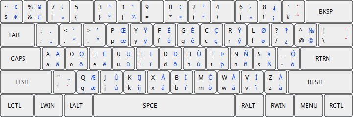

**Dvorak for Programmers, with European Keys**
==============================================

This is a famous Dvorak for Programmers keyboard layout (initially made by Ronald Kaufmann) upgraded to include European characters, that match the original letters in the same way they do in [EurKEY](https://eurkey.steffen.bruentjen.eu) layout (by Steffen Bruentjen):

